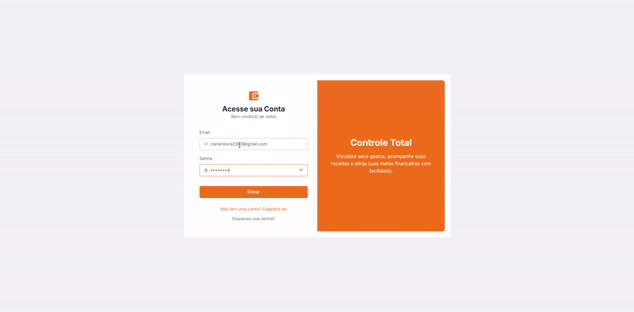
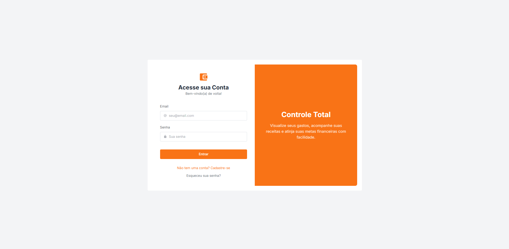
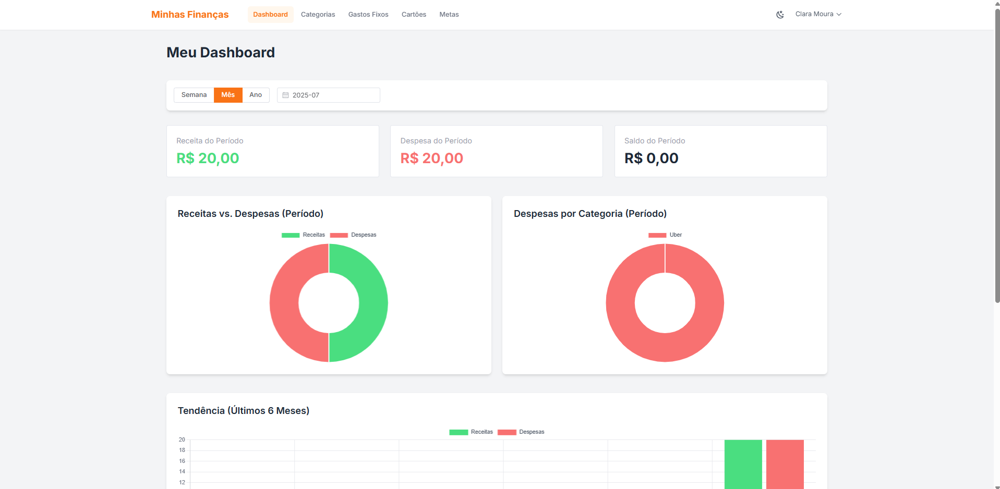
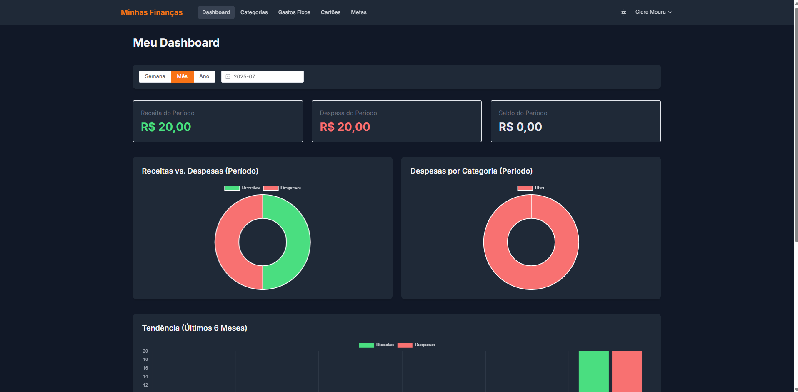
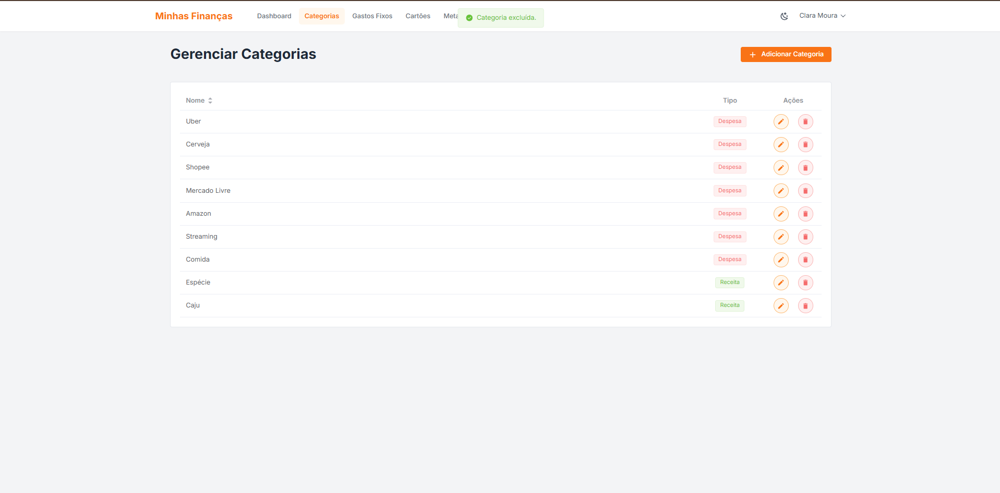

# App Finanças Pessoais - Minhas Finanças v1.0


Aplicação full-stack de gerenciamento financeiro pessoal, desenvolvida com NestJS, Vue.js 3, GraphQL e MongoDB. O projeto abrange desde a autenticação de usuários até dashboards interativos com gráficos e filtros dinâmicos.

---

### 🚀 Acesse a Aplicação

* **Frontend (Vercel):** [https://financial-app-ten-smoky.vercel.app/](https://financial-app-ten-smoky.vercel.app/)
* **Backend (GraphQL Playground):** [https://financial-app-backend-st78.onrender.com](https://financial-app-backend-st78.onrender.com)

---

### ✨ Demonstração



> _🎥 | Assista à demonstração completa **[no YouTube]([URL_DO_SEU_VIDEO_AQUI](https://youtu.be/La8h5kswoDk))**_

---

### 🖼️ Screenshots

| Tela de Login | Dashboard (Tema Claro) |
| :-----------: | :--------------------: |
|  |  |

| Dashboard (Tema Escuro) | Gerenciamento de Categorias |
| :-----------: | :--------------------: |
|  |  |

---

## 📋 Funcionalidades

-   **Autenticação Completa:** Registro, Login (JWT), Perfil de Usuário e fluxo de Redefinição de Senha por e-mail.
-   **Dashboard Interativo:** Visão geral com cards de resumo, gráficos reativos e filtros dinâmicos por período (semana, mês, ano), categoria e descrição.
-   **Gestão de Transações:** CRUD completo para receitas, despesas e gastos no cartão.
-   **Gestão de Categorias:** CRUD completo para categorias personalizadas.
-   **Gestão de Gastos Fixos:** CRUD para despesas recorrentes, com geração automática de transações mensais.
-   **Gestão de Cartões de Crédito:** CRUD para cartões, com geração e fechamento automático de faturas mensais.
-   **Visualização de Faturas:** Tela dedicada para visualizar os detalhes e transações de cada fatura.
-   **Metas Financeiras:** Crie e acompanhe o progresso de suas metas de economia.
-   **Tema Claro e Escuro (Dark Mode):** Seletor de tema com persistência.
-   **Exportação para CSV:** Exporte suas transações filtradas com um clique.
-   **Lembretes por E-mail:** Rotina automática no backend para notificar sobre contas a vencer.
-   **Design Responsivo:** Interface adaptada para desktop e dispositivos móveis.

---

## 🛠️ Stack de Tecnologia

**Frontend:** Vue.js 3, Vite, TypeScript, Tailwind CSS, Element Plus, Pinia, Vue Router, Apollo Client, Chart.js, VueUse.

**Backend:** NestJS, TypeScript, GraphQL, Apollo Server, Mongoose, Passport.js, Nodemailer, Json2Csv.

**Banco de Dados & Infra:** MongoDB Atlas, Render/Fly.io (Backend), Vercel (Frontend), Docker.

---


## 🚀 Como Rodar Localmente

1. **Clone o repositório:**
   ```bash
   git clone [https://github.com/claralmoura/financial-app.git](https://github.com/claralmoura/financial-app.git)
   cd financial-app
   ```

2. **Setup do Backend:**
   ```bash
   cd backend
   npm install
   ```
   - Renomeie `.env.example` para `.env` e preencha as variáveis `DATABASE_URL` e `JWT_SECRET`.
   ```bash
   npm run dev
   ```

3. **Setup do Frontend:**
   ```bash
   cd frontend
   npm install
   ```
   - Crie um arquivo `.env` e adicione `VITE_API_URL=http://localhost:3000/graphql`.
   ```bash
   npm run dev
   ```

---

## ✒️ Autoria

Feito com ❤️ por Clara Livia.

[](https://www.linkedin.com/in/claralivia/)
[](https://github.com/claralmoura)
